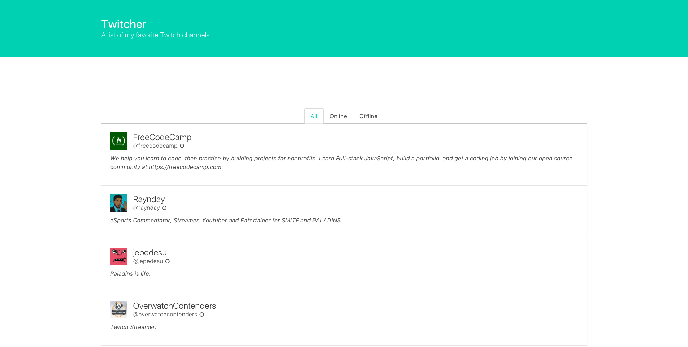

# Twitcher
A list of my favorite Twitch streams. Built for FreeCodeCamp.

Codepen: [https://codepen.io/jepe-ada/pen/xrLdQy](https://codepen.io/jepe-ada/pen/xrLdQy)

[](http://forthebadge.com)
[](http://forthebadge.com)
[](http://forthebadge.com)

## Screenshot


## Instructions

### Development Instructions
- Install NPM and Node first if you haven't yet.
- Install Pingy with `npm install -g @pingy/cli`.
- Run `npm install` and `yarn`.
- Run `pingy dev` to start the development server. This will open the project with hot reloading.

### Deployment Instructions
- Run `pingy export`. Doing this will create the `dist` folder.
- Navigate to the `dist` folder and deploy however you want.
- *Optional*: If you want to deploy with [Surge](#stack), install Surge first and run `surge` on this directory.

### Directory Structure
- The `images` folder contains the images for this README.
- The `scripts` folder contains the JS code for the project. You can read the [scripts](#scripts) section below for more information.
- The `styles` folder contains the CSS code for the project. You can read the [styles](#styles) section below for more information.
- The `dist` folder contains the exported files for deployment. This is generated by `pingy export`.

### Scripts
The source script here is `main.babel.js`.
After `pingy export`, this file and all its dependencies is converted to `main.js`.
To use this in your HTML, you reference this as `main.js`.
So if you have a `scripts.babel.js`, it is converted to `scripts.js`, which you reference like so:
```html
<script src="scripts/scripts.js" defer></script>
```
This `main.babel.js` contains ES6 code. You can also try Coffeescript, etc.
Follow the [Pingy](#stack) link below for more information.

### Styles
The source stylesheet here is `main.scss`.
After `pingy export`, this file and all its dependencies is converted to `main.css`.
To use this in your HTML, you reference this as `main.css`.
So if you have a `styles.scss`, it is converted to `styles.css`, which you reference like so:
```html
<link rel="stylesheet" href="styles/styles.css">
```
This `main.scss` contains SCSS code. You can also try Sass, Stylus, etc.
Follow the [Pingy](#stack) link below for more information.

## Stack
- Frontend UI framework: [Cell](https://www.celljs.org/) - *A self-constructing web app framework powered by a self-driving DOM.*
- Design Library: [Bulma](http://bulma.io/) - *A modern CSS framework based on Flexbox.*
- Build Tool: [Pingy](https://pin.gy/cli/) - *Zero-configuration build tool.*
- Hosting: [Surge](http://surge.sh/) - *Super fast hosting for static pages.*

## License
MIT
